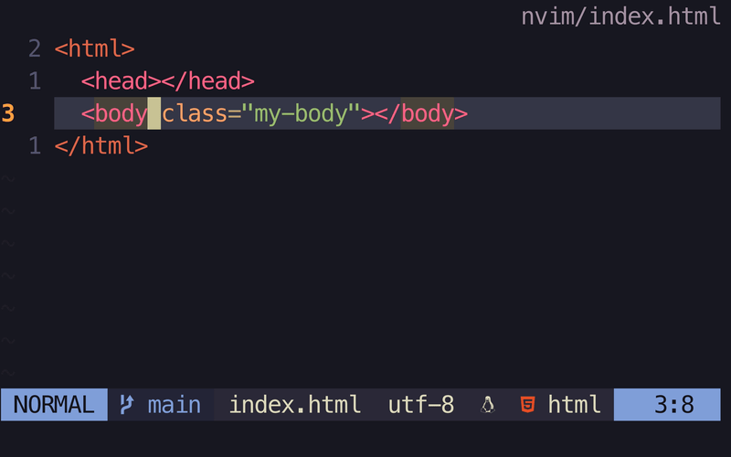

# classy.nvim

A simple Neovim plugin for adding and removing class attributes in your HTML/JSX document.



## 💫 Features

- add/remove class attribute from any HTML element
- can handle nested elements too
- works for HTML/JSX/TSX documents
- configurable to use single/double quotes
- uses treesitter to find correct element and make it work regardless of your cursor position

## 🔦 Usage

`classy` provides two functions you can easily map and use: `ClassyAddClass` and `ClassyRemoveClass`

```lua
vim.keymap.set('n', <leader>ac, :ClassyAddClass<CR>)
vim.keymap.set('n', <leader>dc, :ClassyRemoveClass<CR>)
```

## 💻 Setup

### Prerequisites:

- [nvim-treesitter](https://github.com/nvim-treesitter/nvim-treesitter): `classy` depends on treesitter to parse your code
- Language parsers: install each parser for the language you are writing

### Installation

Use your favorite plugin manager to install.
I'm using packer[`packer.nvim`](https://github.com/wbthomason/packer.nvim) in this example.

```lua
use({
  "jcha0713/classy.nvim",
})
```

## 🧮 Configuration

Run setup function in your `init.lua` file:

```lua
require('classy').setup({
  -- these are the default values
  use_double_quote = true,
  insert_after_remove = false,
  move_cursor_after_remove = true,
})
```

### `use_double_quote`

**type**: `boolean`
**default**: `true`

If this is set to `false`, then `classy` uses a pair of single quotation marks instead of double when adding a new class attribute to the tag. The default is set to true.

### `insert_after_remove`

**type**: `boolean`
**default**: `false`

You can set `insert_after_remove` to true if you want to change to insert mode every time you remove a class attribute. This is false by default.

### `move_cursor_after_remove`

**type**: `boolean`
**default**: `true`

Determines whether to move the cursor to the position where class removal happens. This is useful when you try to remove a class attribute while your cursor is on the closing tag of a deeply nested element.

## ⚠️ Contributing

Any PRs or issues to improve the quality of the plugin are appreciated. I have not tested for all kinds of UI framework out there so please let me know if there is any bug, so I can help!

## 🙏 Credit

The idea of `classy` comes from this random [tweet](https://twitter.com/justinrassier/status/1584632886938173441?s=20&t=kixISG6hBcPfFhXPnJFRqA) I found. Thank you `@justinrassier`!
